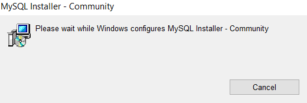

##Установка MySQL на Windows 10
* Скачиваем инсталлер по 
[ссылке](https://dev.mysql.com/get/Downloads/MySQLInstaller/mysql-installer-community-8.0.21.0.msi).

* Открываем инсталлер

* Выбираем пункт **Server only**, кликаем **Next** 

* Кликаем **Execute**

* Затем **Next** 

* Снова **Next**

* Выбираем Standalone MySQL Server / Classic MySQL Replication, **Next**

* Оставляем всё как есть, **Next**

* Оставляем всё как есть, **Next**

* Заводим user'а с логином и паролем, заводим root-password, **Next**

* Оставляем всё как есть, **Next**

* Применяем настройки нажав **Execute**

* Настройка системы завершена **Finish**

* Далее **Next**

* И ещё раз **Finish**

